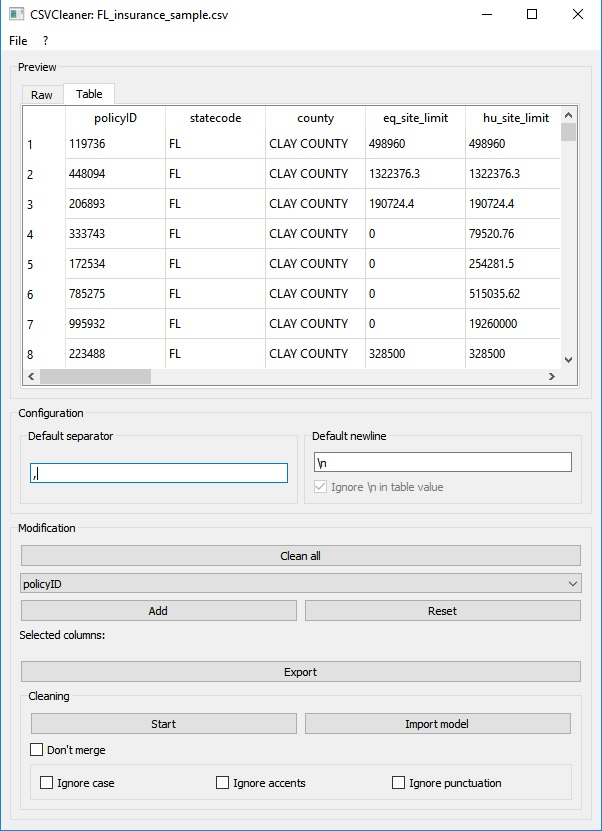
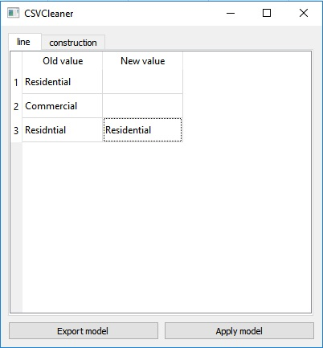

## CSVCleaner
CSVCleaner is a software made to easily clean your CSV files.

You can download it latest version on the [release page](https://github.com/Xwilarg/CSVCleaner/releases).

### How does it work ?
Once you launched the software it will display the following window: 

You can open your CSV in File > Open (or with Ctrl + O)

The Preview window allow you to see how your CSV looks like.

If your CSV is ill-formated you can change the separator and the new line in the Configuration window (then press Ctrl + R to refresh) 
(If you change your new lines you might want to let "Ignore \n in table value" tick so the software will ignore \h)

Then come the Modification part: 
You can choose to clean all your CSV (that'll remove useless new lines) 
You can also select columns to export or clean them.

Exporting them create a new CSV with only the selected datas. 
Cleaning them allow to replace some values by others (useful is your CSV have typos in it) 
When cleaning you can choose to ignore case/accents/punctuations (that'll modificate your CSV) or just to not merge anything.

Once you pressed the click button it will open the following window: 

Just replace everything you need and press "Apply model". 
If you want to save your work and continue later you can press "Export model" (you'll be able to load it with the "Import model" button on the Main Window.

Once you finished to work don't forget to save! (File > Save / Ctrl + S)
